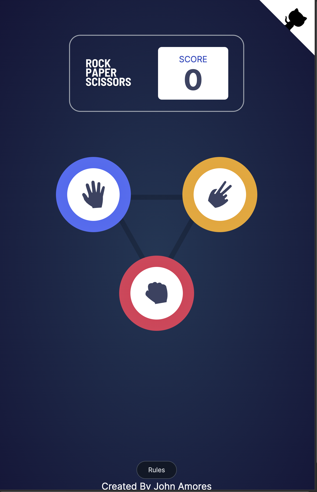
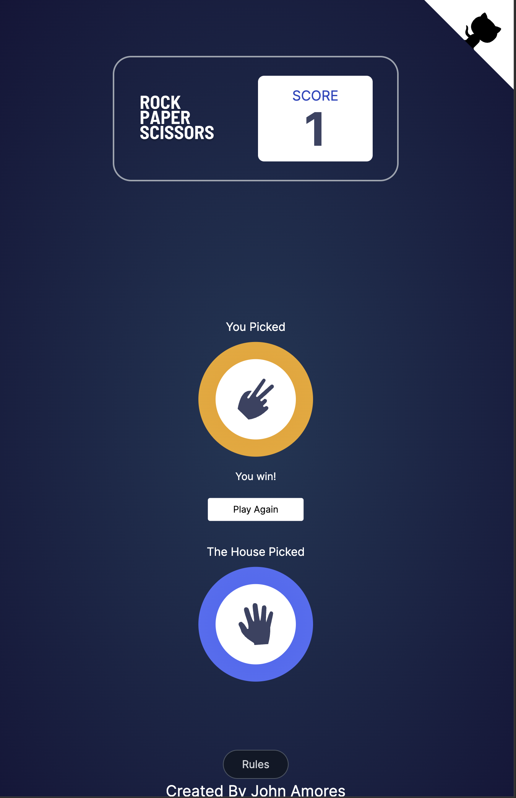

# Frontend Mentor - Rock, Paper, Scissors solution

This is a solution to the [Rock, Paper, Scissors challenge on Frontend Mentor](https://www.frontendmentor.io/challenges/rock-paper-scissors-game-pTgwgvgH). Frontend Mentor challenges help you improve your coding skills by building realistic projects. 

## Table of contents

- [Overview](#overview)
  - [The challenge](#the-challenge)
  - [Screenshot](#screenshot)
  - [Links](#links)
- [My process](#my-process)
  - [Built with](#built-with)
  - [What I learned](#what-i-learned)
  - [Continued development](#continued-development)
  - [Useful resources](#useful-resources)
- [Author](#author)
- [Acknowledgments](#acknowledgments)

**Note: Delete this note and update the table of contents based on what sections you keep.**

## Overview

### The challenge

Users should be able to:

- View the optimal layout for the game depending on their device's screen size
- Play Rock, Paper, Scissors against the computer
- Maintain the state of the score after refreshing the browser _(optional)_
- **Bonus**: Play Rock, Paper, Scissors, Lizard, Spock against the computer _(optional)_

### Screenshot





### Links

-   Solution URL: [Frontend Mentor Solution](https://www.frontendmentor.io/solutions/rock-paper-scissor-game-using-nextjs-ygvHMV1Hgi)
-   Live Site URL: [Rock, Paper, Scissors](https://fm-project-rps.vercel.app)

### Built with

-   [Next.js](https://nextjs.org/) - React framework
-   [Next Themes](https://github.com/pacocoursey/next-themes)
-   [Tailwindcss](https://www.tailwindcss.com)
-   JSON

### What I learned

I wanted to focus on learning [Next.js](https://www.nextjs.org). Specifically I wanted to focus on dynamic page rendering server side

Since, by default, the `/app` directory runs on server side so I had to create a separate component to handle the _theme provider_, tell it to run on the client side `'use client'`, and import into the layout component in the _root_ of the `/app` directory.

**Providers.tsx**

```javascript
'use client'
import { ThemeProvider } from 'next-themes'

export default function Providers({ children }: { children: any }) {
    return <ThemeProvider attribute="class">{children}</ThemeProvider>
}
```

**layout.tsx**

```javascript
export default function RootLayout({
  children,
}: Readonly<{
  children: React.ReactNode;
}>) {
  return (
    <html lang="en">
      <body className={inter.className} style={{ position: 'relative', minHeight: '100vh' }}>
        <div className="flex flex-col items-center" style={{ padding: '20px' }}>
          <Providers>
            <main>{children}</main>
          </Providers>
        </div>
        {...}
      </body>
    </html>
  );
}
```

### Continued development

- [] Adjust the "Rules" modal to render from the score card component
- [] Add a "Multiplayer Component" button to allow multiple users to play
- [] Add a "Leaderboard" component to display the top scores
- [] Update the "Rules" modal to display rules for each game


## Author

-   Website -
-   Frontend Mentor -
